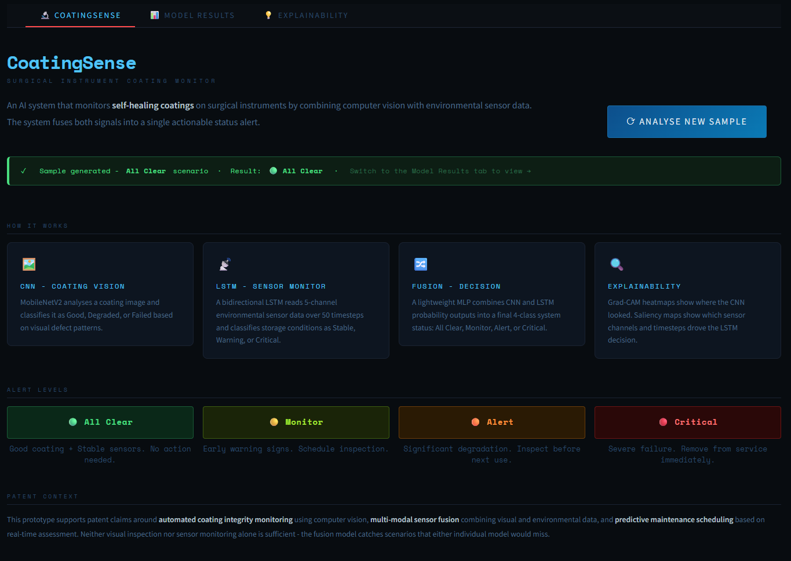
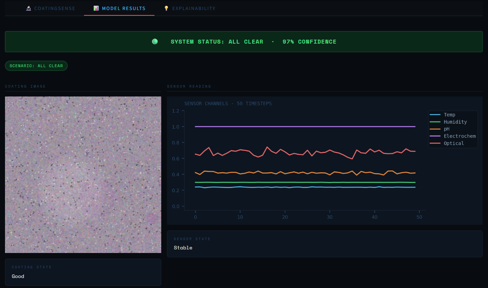

# CoatingSense - Surgical Instrument Coating Monitor

> An AI system for real-time monitoring of self-healing coatings on surgical instruments, combining computer vision with multi-sensor fusion and full explainability.

---

## Overview

Surgical instruments with self-healing coatings require continuous monitoring to maintain coating integrity during storage and use. Manual inspection is subjective, inconsistent, and reactive. **CoatingSense** addresses this with an automated dual-modal AI pipeline that simultaneously analyses coating condition from camera images and environmental conditions from sensor data, fusing both signals into a single actionable status alert.

The core insight is that **neither visual inspection nor sensor monitoring alone is sufficient**. A coating may appear intact while storage conditions are actively degrading it. Sensors may look stable while visible damage is already present. The fusion model catches both scenarios - and everything in between.

---

## Live Demo

https://coatingsense.streamlit.app/

---

## Screenshots

### Dashboard


---

### Model Results



---

### Explainability


---

## System Status Levels

| Status | Condition | Action |
|---|---|---|
| 🟢 **All Clear** | Good coating + Stable sensors | No action required |
| 🟡 **Monitor** | Early degradation or mild sensor anomaly | Schedule inspection at next cycle |
| 🟠 **Alert** | Significant degradation detected | Inspect before next use |
| 🔴 **Critical** | Severe coating failure confirmed | Remove from service immediately |

---

## Architecture

The system runs three models in sequence:

```
┌──────────────────────────────────────────────────────────────┐
│                         INPUT                                │
│                                                              │
│   Coating Image (224×224 RGB)    Sensor Data (50 timesteps)  │
│   [Camera / imaging system]      [5 channels: Temp, Humidity,│
│                                  pH, Electrochemical,Optical]│
└──────────────┬───────────────────────────┬───────────────────┘
               │                           │
               ▼                           ▼
  ┌────────────────────┐       ┌───────────────────────┐
  │  CNN               │       │  LSTM                 │
  │  MobileNetV2       │       │  Bidirectional        │
  │  Frozen backbone   │       │  2-layer, hidden=64   │
  │                    │       │                       │
  │  Good              │       │  Stable               │
  │  Degraded          │       │  Warning              │
  │  Failed            │       │  Critical             │
  │  [3 probabilities] │       │  [3 probabilities]    │
  └──────────┬─────────┘       └────────────┬──────────┘
             │                              │
             └──────────────┬───────────────┘
                            │  6 inputs
                            ▼
               ┌────────────────────────┐
               │  Fusion MLP            │
               │  Dense(128→64→32→16)   │
               │                        │
               │  All Clear             │
               │  Monitor               │
               │  Alert                 │
               │  Critical              │
               └────────────────────────┘
```

### Fusion Decision Logic

| CNN Output | LSTM Output | System Status |
|---|---|---|
| Good | Stable | 🟢 All Clear |
| Good | Warning | 🟡 Monitor |
| Degraded | Stable | 🟡 Monitor |
| Degraded | Warning | 🟡 Monitor |
| Good | Critical | 🟠 Alert |
| Failed | Stable | 🟠 Alert |
| Degraded | Critical | 🔴 Critical |
| Failed | Warning | 🔴 Critical |
| Failed | Critical | 🔴 Critical |

---

## Explainability

Because this is a medical context, the system explains every decision it makes.

| Method | Model | What it shows |
|---|---|---|
| **Grad-CAM** | CNN | Heatmap showing which regions of the coating image drove the classification |
| **Gradient Saliency** | LSTM | Which sensor channels and timesteps most influenced the condition classification |
| **SHAP KernelExplainer** | Fusion | How much each of the 6 input probabilities pushed the final decision toward or away from the predicted status |

---

## Results

All models trained on synthetic data with 1000 samples per class.

| Model | Task | Accuracy |
|---|---|---|
| CNN (MobileNetV2) | Coating Quality Classification | ~87% |
| LSTM (Bidirectional) | Sensor Condition Classification | ~99% |
| Fusion MLP | System Status Classification | ~90% |

**Per-scenario demo accuracy:**

| Scenario | Accuracy |
|---|---|
| All Clear | 70% |
| Monitor | 100% |
| Alert | 90% |
| Critical | 100% |

> Models are trained on synthetically generated data. Real-world accuracy will depend on actual instrument images and calibrated sensor hardware.

---

## Project Structure

```
CoatingSense/
├── app.py                        # Main Streamlit application
├── components/
│   ├── __init__.py
│   ├── generators.py             # Synthetic image and sensor data generation
│   ├── models.py                 # Model loading and inference
│   ├── explainability.py         # Grad-CAM, saliency, SHAP, insight text
│   └── charts.py                 # All matplotlib chart functions
├── models/
│   ├── cnn_README.md             # Instructions for CNN model
│   ├── lstm_README.md            # Instructions for LSTM model
│   └── fusion_README.md          # Instructions for Fusion model
├── training/
│   ├── data_generation.py        # Generate synthetic dataset
│   ├── cnn_training.py           # Train CNN model
│   ├── lstm_training.py          # Train LSTM model
│   └── fusion+demo.py            # Train Fusion model
├── data/                         # Generated synthetic data (not included)
├── requirements.txt
├── LICENSE
├── .gitignore
└── README.md
```

---

## Streamlit App

The app runs across three tabs:

**Tab 1 - CoatingSense**
Project overview, system description, alert level reference, and the Analyse button. Each click randomly selects a scenario and runs the full inference pipeline.

**Tab 2 - Model Results**
Live system status banner, generated coating image, sensor channel chart, and probability outputs from all three models side by side.

**Tab 3 - Explainability**
Grad-CAM heatmap with CNN insight, LSTM saliency map with sensor analysis, SHAP attribution chart with fusion reasoning, and a clinical recommendation - all laid out with the chart and its explanation side by side.

---

## Setup

### Prerequisites

- Python 3.10+
- Git

### Installation

```bash
git clone https://github.com/arjunmehra05/CoatingSense.git
cd CoatingSense
python -m venv .venv

# Windows
.\.venv\Scripts\Activate.ps1

# macOS / Linux
source .venv/bin/activate

pip install -r requirements.txt
```

### Run the App

```bash
streamlit run app.py
```

Opens at `http://localhost:8501`

### Training the Models

To generate your own models (required before running the app):

1. Generate synthetic data:
   ```bash
   python training/data_generation.py
   ```

2. Train the CNN model:
   ```bash
   python training/cnn_training.py
   ```

3. Train the LSTM model:
   ```bash
   python training/lstm_training.py
   ```

4. Train the Fusion model:
   ```bash
   python training/fusion+demo.py
   ```

The trained models will be saved in the `models/` directory.

---

## Dependencies

```
tensorflow
opencv-python-headless
matplotlib
seaborn
scikit-learn
Pillow
numpy
streamlit
shap
```

---

## Synthetic Data

Real surgical instrument coating images are not publicly available, so all training data is synthetically generated to simulate realistic conditions.

**Coating Images (224×224 RGB)**
- Variable base texture, colour, and lighting per image
- Subtle cracks blended into base coating for degraded class
- Soft-edged discoloration patches simulating oxidation
- Prominent damage patches with deep cracks for failed class
- Random rotation, lighting variation, and pixel noise across all classes

**Sensor Sequences (50 timesteps × 5 channels)**
- Channels: Temperature, Humidity, pH, Electrochemical activity, Optical transmittance
- Stable: low-noise baseline around safe operating ranges
- Warning: gradual multi-channel drift accumulating toward later timesteps
- Critical: accelerated drift with random spike events

---

## Training

The models can be trained locally using the scripts in the `training/` directory:

| Script | Purpose |
|---|---|
| `data_generation.py` | Generate synthetic coating images and sensor sequences |
| `cnn_training.py` | Train CNN model on coating images |
| `lstm_training.py` | Train LSTM model on sensor data |
| `fusion+demo.py` | Train Fusion model combining CNN and LSTM outputs |

---

## Patent

This project supports a published patent covering:

- Automated coating integrity monitoring using computer vision on instrument surfaces
- Multi-modal sensor fusion combining visual and environmental data
- Predictive maintenance scheduling based on real-time coating condition assessment
- Self-healing coating lifecycle management with automated alert thresholds

---

## Future Work

- Replace synthetic training data with real coating images from clinical instruments
- Integrate with physical IoT sensors in instrument storage environments for live inference
- Fine-tune on small real datasets after pretraining on synthetic data
- Track individual instrument coating degradation over time using instrument ID
- Convert models to TFLite for edge deployment in operating room environments
- Extend to other surgical instrument surface treatments beyond self-healing coatings

---

## License

This project is proprietary. All rights reserved.

&copy; 2026 Arjun Mehra